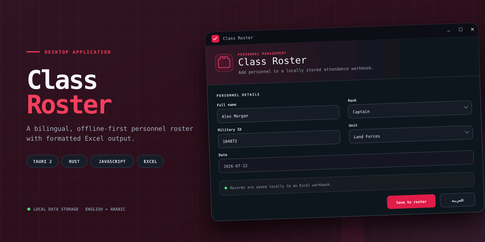
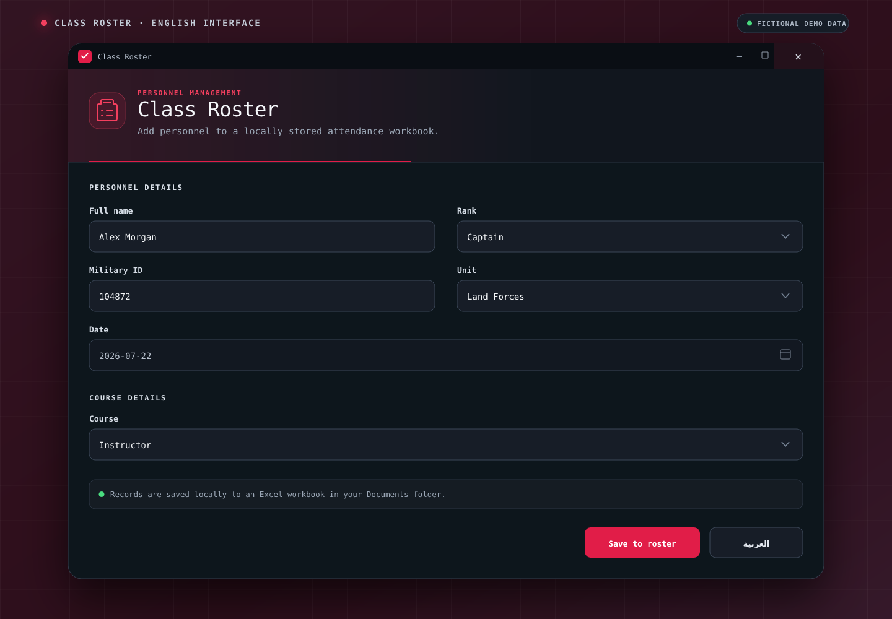
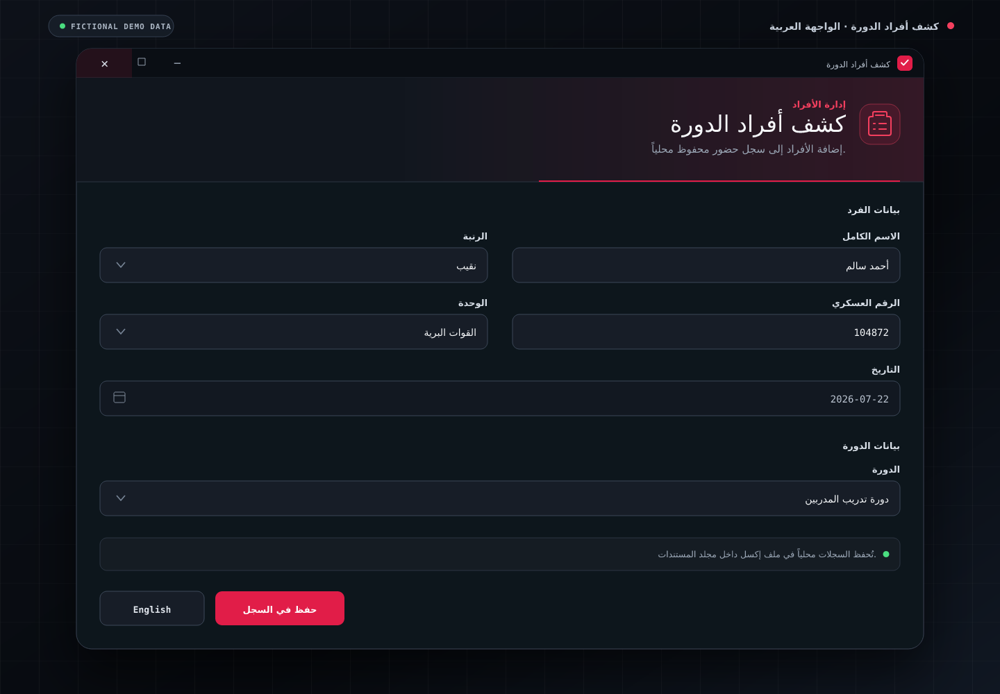

# Class Roster

Class Roster is a bilingual desktop application for recording course attendees in a structured Excel workbook. Built with Tauri, Rust, JavaScript, HTML, and CSS, it provides English and Arabic interfaces while keeping all personnel data on the user's computer.



## Screenshots

### English interface



### Arabic interface



## Features

- English and Arabic interfaces with right-to-left layout support
- Structured entry for names, ranks, military IDs, units, dates, and courses
- Local Excel output that preserves the roster template's formatting
- Frontend and Rust backend input validation
- Protection against spreadsheet-formula injection
- Responsive dark interface with accessible status messages
- Offline operation with no remote database, analytics, or network service

## Technology

| Layer | Technology |
| --- | --- |
| Desktop application | Tauri 2 |
| Backend | Rust |
| Spreadsheet processing | `umya-spreadsheet` |
| Frontend | JavaScript, HTML, CSS |
| Build tooling | Vite, npm |
| Data output | Microsoft Excel (`.xlsx`) |

## How It Works

1. The user completes the bilingual personnel form.
2. JavaScript validates the required fields and sends the record to a Tauri command.
3. Rust validates the record again and identifies the next available roster row.
4. The application writes the record while preserving the workbook's existing styles.
5. The updated workbook is saved locally in the user's Documents folder.

The generated workbook is stored at:

```text
Documents/Personnel Management System/database.xlsx
```

The bundled template contains no real personnel records. The generated `database.xlsx` file remains outside the repository and should never be committed.

## Prerequisites

- [Node.js](https://nodejs.org/) 20.19 or later
- [Rust](https://www.rust-lang.org/tools/install) 1.85 or later
- The [Tauri system prerequisites](https://v2.tauri.app/start/prerequisites/) for your operating system

### Windows requirements

Windows development requires:

- Microsoft C++ Build Tools with **Desktop development with C++** selected
- Microsoft Edge WebView2
- The Rust MSVC toolchain

Confirm that Rust is using the MSVC toolchain:

```powershell
rustc -vV | Select-String "host"
```

If the host ends in `gnu`, switch toolchains:

```powershell
rustup default stable-msvc
```

### Ubuntu requirements

Install Tauri's Linux system dependencies:

```bash
sudo apt update
sudo apt install libwebkit2gtk-4.1-dev \
  build-essential \
  curl \
  wget \
  file \
  libxdo-dev \
  libssl-dev \
  libayatana-appindicator3-dev \
  librsvg2-dev
```

## Install and Run

### Windows PowerShell

From the repository root:

```powershell
npm.cmd ci
npm.cmd run check
cargo test --manifest-path .\src-tauri\Cargo.toml
npm.cmd run tauri:dev
```

Using `npm.cmd` avoids common PowerShell script-execution policy errors.

### Ubuntu

From the repository root:

```bash
npm ci
npm run check
cargo test --manifest-path src-tauri/Cargo.toml
npm run tauri:dev
```

The first native build can take several minutes while Rust compiles the dependencies. Press `Ctrl+C` in the terminal to stop the development process.

## Web Interface Preview

To preview only the frontend:

```bash
npm run dev
```

Open the local address displayed by Vite. Saving records is unavailable in the browser-only preview because it does not run the Rust backend.

## Testing

Run all automated checks:

```bash
npm run check
cargo test --manifest-path src-tauri/Cargo.toml
cargo fmt --manifest-path src-tauri/Cargo.toml --check
cargo clippy --manifest-path src-tauri/Cargo.toml --all-targets --all-features
```

When manually testing the application, use fictional data and confirm that:

1. The English and Arabic interfaces display correctly.
2. Required-field and date validation messages appear correctly.
3. A valid record is saved successfully.
4. The generated workbook contains the record in the correct row and columns.
5. A second record is added without overwriting the first.

Close the workbook in Excel before saving another record.

## Build a Release

Build a platform-specific application package:

```bash
npm run tauri:build
```

On PowerShell, you can use:

```powershell
npm.cmd run tauri:build
```

Tauri places build artifacts under:

```text
src-tauri/target/release/bundle/
```

A Windows build produces Windows packages, while an Ubuntu build produces Linux packages.

## Project Structure

```text
class-roster/
├── docs/
│   └── images/                  # README screenshots
├── frontend/
│   ├── css/                     # Dark-theme interface styles
│   ├── javascript/              # Form behavior and translations
│   └── index.html               # Application interface
├── src-tauri/
│   ├── capabilities/            # Tauri window permissions
│   ├── icons/                   # Desktop application icons
│   ├── resources/               # Blank Excel roster template
│   └── src/                     # Rust validation and workbook logic
├── .github/                     # CI and dependency update configuration
├── package.json                 # Frontend scripts and dependencies
└── vite.config.js               # Frontend build configuration
```

## Privacy and Security

- Records are stored locally and are not transmitted to an external service.
- User-entered text is checked for spreadsheet-formula prefixes.
- The application validates input in both JavaScript and Rust.
- The generated workbook is not encrypted. Users remain responsible for operating-system permissions and organizational data-handling requirements.

## Limitations

- The bundled workbook supports 62 roster entries.
- The workbook must be closed in Excel before the application can save another record.
- The application currently stores data in a local Excel workbook rather than a database.

## Troubleshooting

### Worksheet missing after upgrading

Version 2.0.1 corrects the roster template's worksheet compatibility. If version 2.0.0 created a `database.xlsx` file that cannot be opened by the application, preserve that file as a backup and allow version 2.0.1 to create a new workbook.

### Windows linker errors

Errors mentioning `link.exe` usually mean the Microsoft C++ Build Tools are missing or the **Desktop development with C++** workload was not installed.

### Workbook cannot be saved

Close `database.xlsx` in Excel or another spreadsheet program, then try saving the record again.

## Contributing

See [CONTRIBUTING.md](CONTRIBUTING.md) for development expectations. Use fictional information in tests, screenshots, issues, and pull requests.

## License

Licensed under the [MIT License](LICENSE).

Created by [Ryan Wynn](https://www.linkedin.com/in/ryan-wynn-01a784403/).
